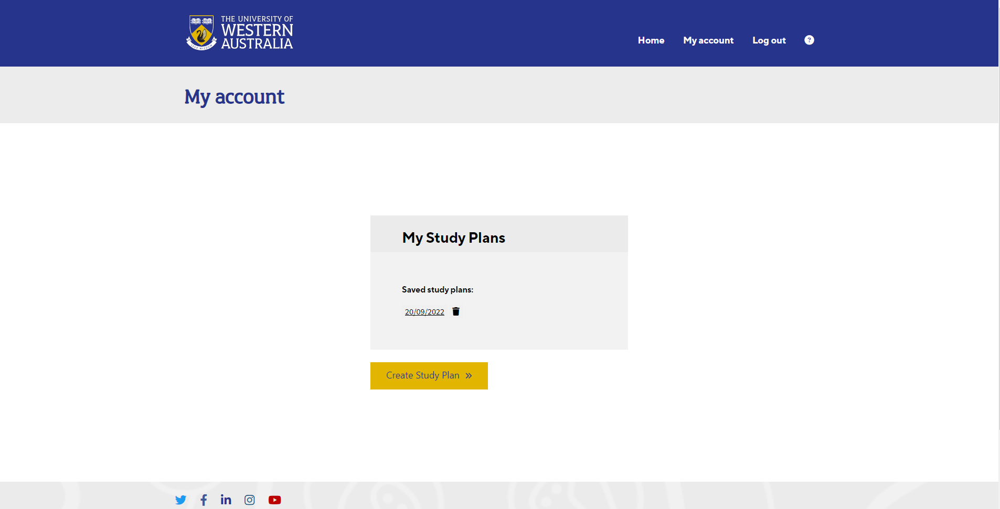
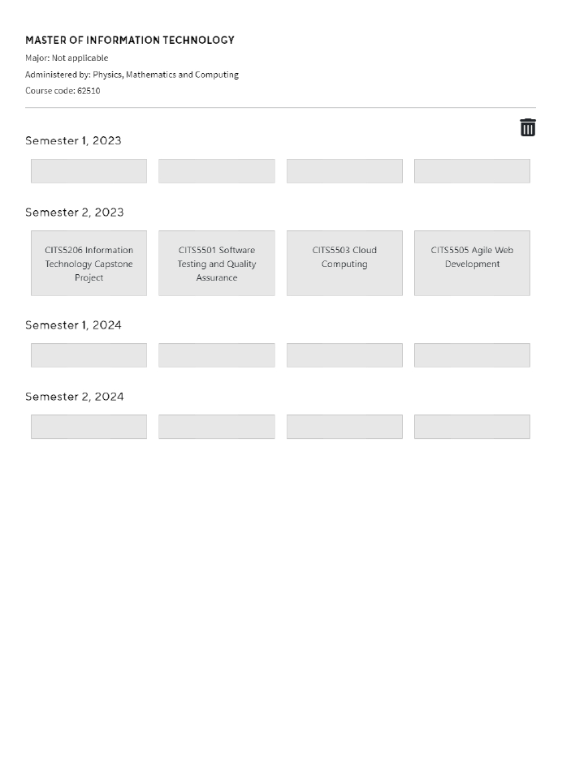

# Study Planner
This is the main repository and project planning page of Study Planner Team 1 (CITS5206 Professional Computing).

___

## User manual
1. [Project details](#project-details)
2. [How to run the Study Planner project](#how-to-run-the-project)
3. [Flask API](#flask-api)
4. [Database](#database)
5. [Data](#data)
6. [Functionality](#functionality)
   1. [Sign up](#sign-up)
   2. [Log in](#login)
   3. [Create a study plan](#creating-a-study-plan)
   4. Save study plan
   5. Download study plan

___

## Project details
UWA have identified a need for a tool that allows current students, prospective students, and UWA staff, to create study plans of the university’s courses. Currently, study plans are created by hand based on the unit sequence, course rules, and semester availability, which are stored in UWAs CAIDi curriculum management system. A Study Planner tool could reduce the risk of human error and thus allow for the generation of more reliable study plans.

The Study Planner project uses Flask as the backend framework and FlaskSQLAlchemy for the database. For a full list of imported libraries, please view the requirements.txt file.

___

## How to run the project
First you will want to cd to the project directory in which you want to host the Study Planner project and then clone the project files from GitHub: `git clone https://github.com/QianrXU/Study-Planner.git`

Follow the steps below to run the project on differetn operating systems:

### Mac
**If virtual environment not installed:** Use pip or another package manager to install the virtual environment package: `$ sudo apt-get install python3-venv`

1. cd into project folder: `$ cd Study-Planner`
2. Create a virtual environment: `$ python3 -m venv venv`
3. Activate the python virtual environment: `$ source venv/bin/activate`
4. Install prerequisites (requires python3, flask, venv, etc.): `$ pip3 install -r requirements.txt`.
5. To run the app: `$ flask run`. This should start the app running on localhost at port 5000, i.e. http://localhost:5000/
6. To deactivate the project on localhost: `$ ^C`
7. To deactivate the virtual environment: `$ deactivate`

### Unix
**If virtual environment not installed:** Use pip or another package manager to install the virtual environment package: `$ sudo apt-get install python3-venv`

1. cd into project folder: `$ cd Study-Planner`
2. Create a virtual environment: `$ python3 -m venv venv`
3. Activate the python virtual environment: `$ source venv/bin/activate`
4. Install prerequisites (requires python3, flask, venv, etc.): `$ pip3 install -r requirements.txt`.
5. To run the app: `$ flask run`. This should start the app running on localhost at port 5000, i.e. http://localhost:5000/
6. To deactivate the project on localhost: `$ ^C`
7. To deactivate the virtual environment: `$ deactivate`

### Windows
**If virtual environment not installed:** Use pip or another package manager to install the virtual environment package: `> pip install virtualenv`

1. cd into project folder: `$ cd Study-Planner`
2. Create a virtual environment: `> virtualenv`
3. Activate the python virtual environment: `> .\venv\Scripts\activate`. This should start the app running on localhost at port 5000, i.e. http://localhost:5000/.
4. Install prerequisites (requires python3, flask, venv, etc.): `> pip install -r requirements.txt`.
5. To deactivate the virtual environment: `> deactivate`

___

## Flask API
Flask is a widely used micro web framework for creating APIs in Python, which serves as the backend of our project. 

### Installation 
Install Flask using pip
```
pip install Flask
```
### Flask App
Can refer to the files `__init__.py`, `routes.py`, `models.py`, and `app/forms.py` in the app folder.

#### /app/__init__.py
Understand the working of the codes:  
`from flask import Flask` Import the Flask class.

`app = Flask(__name__)` This creates an instance of the class.

`from app import routes, models, forms` This connects the instance of the class to the routes, models, and forms. 

`if __name__ == '__main__'` `__name__` is a special variable in Python which takes the value of the script name. This line ensures that our Flask app runs only when it is executed in the main file and not when it is imported in some other file.

`app.run(debug=True)` Run the Flask application with enabling the debug mode. Whenever code changes, the server will automatically reload and will show an interactive debugger in the browser with occurrences of errors during a request.

#### /app/routes.py
Several routes have been included in the file: /index, /signup, /login, /logout, /account, /createstudyplan-courses, /createstudyplan-majors, /createstudyplan-units, /faq and a page_not_found(e) function has been set up to deal with invalid routes.

- The /index route renders index.html.
- The /signup route renders signup.html.
- The /login route renders login.html.
- The /logout route redirects to index.html when users log out.
- The /accout route renders myaccount.html.
- The /createstudyplay-course route renders 1grid-createstudyplan.html.
- The /createstudyplay-course route renders 2grid-createstudyplan.html.
- The /createstudyplay-course route renders 3grid-createstudyplan.html.
- The page_not_found(e) function renders 404.html.

`from flask import render_template` Import the method render_template() to render templates.

`@app.route(‘/index’, methods=['GET', 'POST'])` We use the route() decorator to tell Flask what URL should trigger the function. Methods specify which HTTP methods are allowed. The default is ['GET’].

```
def index():
    return render_template('index.html', title='Home')
```
Specify the name of the template and the variables you want to pass to the template engine as keyword arguments and Flask will look for templates in the templates folder.  

#### /app/models.py
This is related to the database and will be further explained in the Database part.

#### /app/forms.py
There are two Flask form inside the file to support the signup function and login function. Each field of the forms are clearly stated with formats and validations have been added to the forms.
___

## Database 
SQLAlchemy is used as the database for this project, it is a Python SQL toolkit and Object Relational Mapper.

### Database schema

The following diagram shows the abstract desgin for the data storage in the database.   

   

### User Table
The User table is used to store the registered user information.
- id is an automatically generated index and is a Primary Key.
- email records user's registered email address. It is unique which means one email address can register for one account
- password_hash records the encrypted password to ensure privacy.

### Four_Sem_SP Table
This table can store a study plan for four semesters with five units each semester at the maximum. Only logged in users can save their study plans into this table.

- selectedCourse, selectedMajor and faculty are straightforward.
- coursecode stands for the unique code for each Course.
- user_id is the Foreign Key linked to the id in the User table.
- Y1S1_1 stands for the first unit planned for year 1, semester 1 and so on. Y2S2_5  stands for the fifth unit (overloading unit) planned for year 2, semester 2


### Interaction with database

#### User Interface
There is no interface presented for users to interact with the tables in the database directly. Users may add values into the database but they may not delete or change any data through the user interface.

2 addition actions are:

- Users can insert values into the User table through Sign Up.
- Users can insert values into the Four_Sem_SP table through save button.

#### Python Script
SQLAlchemy is a Python SQL toolkit and Object Relational Mapper. Users may write SQL queries in python file to create, read, update and delete data in the database.

#### Installation and connection before applying SQL queries.

Installing The Package   
`pip install sqlalchemy`

Connecting to the database   
`import sqlalchemy as db`   
`engine = db.create_engine('sqlite:///app/db.sqlite')`   
`connection = engine.connect()`   
`metadata = db.MetaData()`   

#### Command Line

Type ***python*** in Terminal to start a Python interactive session, then follow the **Python Script** instruction.

___

## Data
All course and unit data used in the Study Planner project has been exported from the UWA CAIDi system and provided to the team by UWA's Curriculum Office. Two files have been key in generating the functionality of the Study Planner tool (both to be found in the *static* subfolder), 1. Json-export.csv, and 2. Unit list.csv. Both these files are processed in *routes.py*, but also in the relevant .html pages using JavaScript (*1course-createstudyplan.html*, *2major-createstudyplan.html* and *3grid-createstudyplan.html*).

### Json-export.csv
The *Json-export.csv* file contains information on all courses at UWA between the years of 2018 and 2022.

Attributes used up to the end of Sprint 2 includes:
* CourseID
* Year
* Structure (this attribute contains all units that belong to the selected course or major/specialisation)
* ListMajors
* Title
* Faculty
* Availability (describes the availability of the course - e.g., may not be available in 2022)

Attributes we wish to incorporate in Sprint 3 includes:
* IntakePeriods - this attribute describes whether a course is available at the beginning of a year, mid-year, or both (to filter the 'select starting year/semester' dropdown)
* StandardFullTimeCompletion - this attribute desribes the standard in years of how long a course is to take to a student to be completed (will determine which grid/database is used on the 'select units' page)

### Unit list.csv
The *Unit list.csv* file is an amalgamation of three active unit sequence csv files for three Master degrees (12520 Master of Translation Studies, 62510 Master of Information Technology and 62550 Master of Professional Engineering). These three files were processed by *join_individual_unit_lists.py* - a program which concatenates and groups units by unit code and exports the result to a new .csv file, *Unit list.csv*. All four files are found in the subfolder *static* > *unit data files*.

Attributes used up to the end of Sprint 2 includes:
* Code
* Title
* Availabilities (describes the availability of the unit, e.g., Semester 1 only)

Attributes we wish to incorporate in Sprint 3 includes:
* Status (whether the unit is available in 2022 or not)
* Content (short description of the unit)
* Outcomes (short description of the outcomes of the unit)
* Corequisites (describes if there are any co-requisites to the unit)
* Incompatibilities (describes if there are any incompatible units related to the selected unit)
* Prerequisites (describes if there are any prerequisites to taking the selected unit)

### Making updates to or exchanging the .csv files
Any changes that are made to the .csv files must follow a certain ruleset. If exchanging any of the .csv files, it is important they are exported from CAIDi the same way as they were when we were initially handed the data.

**Changing the year that courses are filtered by**

In the *routes.py* file, there is a line that reads: `selectedYear = 2022`. Changing the year and saving the file will filter the data in *Json-export.csv*, i.e., course data, to only hold data for the selected year.

**Other reflections**

* The *join_individual_unit_lists.py* file is redundant should the Curriculum Office be able to produce an active sequence unit .csv file that contains all units at UWA.

___

## Functionality
### Sign up
> signup.html

This is the signup page((**Figure 1**)) for new users to register an account to create the study plan. User can enter email address and password, The password should not be less than 6 characters long. Enter the same password you have entered for password in confirm password field. Only registered user will have the access to Myaccount page that will allow user to see his/her saved study plans. Registered user can save the plans for later reference and can be deleted if not needed

||
|:--:|
| <b> Figure 1</b>|

### Login
> login.html

If the user is registered, the user can login using his/her credentials that used at the time of registration. User can use this login page(**Figure 2**) to create, save and delete study plans. If the user enters wrong credentials, the system will alert this and ask to enter correct details. This page also has 'remember me' functionality that allows user to save his/her login information and do not have to be enter the details each login time. If the user is not registered, he can click 'Don't have an account?' link to directs to sign up page. We will be adding forgot password actionality in sprint 3.

||
|:--:|
| <b> Figure 2</b>|

### Home Page
> index.html

All users(registered or not registered) are able to access this page (**Figure 3**) and create study plan, but only the registered users will be able to save the study plan. Clicking 'Create study Plan' directs the user to the course selection page.

||
|:--:|
| <b> Figure 3</b>|

### FAQ Page
> faq.html

Frequently asked questions can be found at this page(**Figure 4**). We are still waiting for more questions from client to add to the list. To land this page, from the navigation bar, click '?'.

||
|:--:|
| <b> Figure 4</b>|

### My Account
> account.html

All logged in users are able to access this page (**Figure 5**). The account page displays the user's saved study plans and allows them to load or delete them. The user may also create a new study plan which will navigate them to the 1grid-createstudyplan.html page.

||
|:--:|
| <b> Figure 5</b>|

### Creating a study plan
The following steps outline how a user goes about the process of creating a study plan, as well as how data is processed in the background to generate the view that users end up with. 

#### Selecting a course
> 1grid-createstudyplan.html

1. Users start by selecting the course they are interested in from the first dropdown on this page. This should (Sprint 3 pending) filter the second dropdown, where users select what semester and year they wish to start studying, based on the availability of the course.
2. The semester/year start dropdown determines what the grid page (Sprint 3 pending) looks like. If a user selects a Semester 2 start, this will be reflected in the grid system. Currently, the Study Planner supports only a Semester 1, 2023 start.

The selected course and beginning year/semester gets sent via AJAX post() to *routes.py* where it is processed to determine what the next page will look like to the user (upon pressing the 'Continue' button).

#### Selecting a major or specialisation
> 2grid-createstudyplan.html

Based on what course the user selected in the previous step, this page will either appear or not appear. This is determined by whether or not the course has a major or specialisation. E.g., If a user selects the Bachelor of Commerce degree, this page will be produced with a dropdown containing 7 majors. These majors are deducted from the *Json-export.csv* file's *ListMajors* attribute. Specialisations on the other hand, are contained within the *Structure* column. If a major or specialisation is selected, it overrides the course selected in the step prior so that the correct units can be pulled based on the major/specialisation decision.

If a user would select a course that does not contain any major or specialisation, they will be redirected instantly to the page described below.

#### Selecting units
> 3grid-createstudyplan.html

This page consists of two windows. One where the user finds all unit groups and units, and one which consists of information relating to the selected course, potential major or specialisation, the faculty that heads the course and the course code, as well as the grid system.

**Unit groups and units**

On the left hand pane under the 'Select units' heading, the selected course or major/specialisation's unit group(s) (e.g., Core, Option, Conversion, etc.) and their associated units will appear. Each unit group has an information tooltip to the right of its header which, upon hover, describes the unit group based on information deducted from the *typeInto* field contained within the *Structure* attribute in *Json-export.csv*.

Each unit has a color. This color explains when it is available to study (pulls from the *Availabilities* attribute contained in *Unit list.csv*). At the bottom of the left hand pane, each key is described to the user (Semester 1 only, Semester 2 only, etc.).

Upon click of a unit, the user currently gets an alert that says what unit they have clicked on. In Sprint 3, we wish to see how we can incorporate the *Content* and *Outcomes* attributes here. This would allow the user to read about individual units.

**Grid system**

The grid system is made up of two parts. The top part provides details to the user in regard to their selected course. The second part which fills the majority of the page consists of the grid system. A layout made up of rows where each row is a semester made up of a total of 5 boxes (one box for each unit). A normal full time study load at UWA is 3-4 units, but students are allowed to overload semesters by taking a maximum of 5 units per semester.

The grid system is currently (at the end of Sprint 2) based on the HTML Drag and Drop API. This allows for units to be dragged from the unit selection pane onto a box in the grid. Clicking on the 'Add' button for a Semester row adds overloading functionality, and if the 'Add' button has been clicked, a 'Remove' button will appear to remove overloading.

Functionality on this page will (Sprint 3 pending) constrain a user's ability to drag units onto the grid based on the following rules:
* Unit group requirements
* Unit availability
* Unit co-requisites
* Unit incompatibilities
* Unit prerequisites

**Saving study plans**

Additionally, this page includes functionality like saving a study plan to a user account (Sprint 3 pending) for logged in users, and downloading a study plan as a PDF for all users. The format of a downloaded study plan can be seen below (**Figure 6**).

||
|:--:|
| <b> Figure 6</b>|

